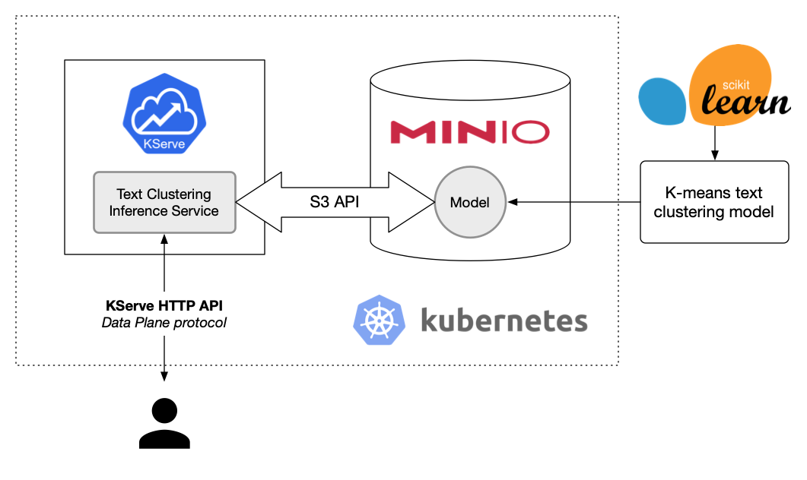

# MLOps Proof of Concept



First, create a Python virtual environment and install the requirements for the scripts. It seems that Python 3.8+ is not well supported (some warnings and deprecation notices arised during the initial tests) thus, it is better to stick with Python 3.7.

```
$ virtualenv --python python3.7 ./scripts/.venv
$ source ./scripts/.venv/bin/activate
$ pip install -r ./scripts/requirements.txt
```

The `text_clustering` script is based on scikit-learn's _[clustering text documents using k-means](https://scikit-learn.org/stable/auto_examples/text/plot_document_clustering.html#sphx-glr-auto-examples-text-plot-document-clustering-py)_ example. Running the following command will result in a mini-batch K-means model being trained on the _20 Newsgroups dataset_. The model can then be used to cluster arbitrary documents by the categories of the dataset.

```
$ python ./scripts/text_clustering.py --lsa 100 --output-dir .
```

Save the top terms of each cluster that appear in the command output for later. This is necessary to make sense of the cluster ID that we get as the output of the model.

```
[...]
2021-10-20 16:34:58 agmangas-macpro.local root[16494] DEBUG Top terms per cluster:
{'Cluster 00': 'windows dos ms os file microsoft com nt run use',
 'Cluster 01': 'au virginia ohio state magnus acs university australia oz '
               'monash',
 'Cluster 02': 'com article sun posting netcom att nntp host distribution ibm',
 'Cluster 03': 'keith caltech morality livesey sgi objective moral atheists '
               'cco com',
 'Cluster 04': 'card video monitor mac apple sale thanks bus university modem',
 'Cluster 05': 'cc access com columbia andrew digex cmu cramer henry posting',
 'Cluster 06': 'car com hp bike like new cars just good article',
 'Cluster 07': 'pitt geb banks gordon cs pittsburgh cadre n3jxp dsl chastity',
 'Cluster 08': 'israel israeli jews armenian arab jewish people turkish '
               'armenians war',
 'Cluster 09': 'nasa gov space jpl larc shuttle jsc center research gsfc',
 'Cluster 10': 'ca game team games hockey year players play season win',
 'Cluster 11': 'university posting host nntp thanks washington distribution '
               'mail usa article',
 'Cluster 12': 'people com don gun like just think government time article',
 'Cluster 13': 'stratus sw cdt com rocket vos tavares computer investors '
               'packet',
 'Cluster 14': 'key clipper chip encryption com keys escrow government netcom '
               'algorithm',
 'Cluster 15': 'drive scsi ide disk drives hard controller floppy com hd',
 'Cluster 16': 'cs se nyx dept science university computer utexas du posting',
 'Cluster 17': 'uk ac university demon article cam dcs ed 44 mathew',
 'Cluster 18': 'file window graphics program files image com use software help',
 'Cluster 19': 'god jesus bible christian christ church christians people '
               'believe faith'}
```

Two new files will appear in the current directory:

- `model.joblib` is the serialized version of the text clustering model.
- `transformer.joblib` is the serialized version of the pre-processing pipeline, including a TF-IDF vectorization step and a latent semantic analysis dimensionality reduction step.

The next step is to prepare the development environment; this is a fairly complicated process that mainly consists of deploying [KServe](https://kserve.github.io/website/) and [MinIO](https://min.io/) on a Kubernetes cluster. Thankfully, we can leverage [Vagrant](https://www.vagrantup.com/) and the `Vagrantfile` in the root of this repostory to automate the creation of an Ubuntu-based virtual machine for testing purposes.

> Please note that the VM requires 12GB of memory and 5 CPU cores.

The following command will initialize an Ubuntu Focal VM and run all the provisioning scripts to:

* Install Docker.
* Install [Kind](https://kind.sigs.k8s.io/) and create a Kubernetes cluster.
* Install Kubectl and Helm.
* Deploy a local image registry.
* Deploy a MetalLB load balancer.
* Install KServe.
* Install and configure MinIO, including a minimal MinIO tenant.
* Deploy a HAProxy reverse proxy to enable external access to KServe's ingress gateway.

It will take a while to finish.

```
$ vagrant up
```

```
$ kubectl get svc -n tenant-tiny
NAME                             TYPE        CLUSTER-IP      EXTERNAL-IP   PORT(S)          AGE
console-service                  NodePort    10.96.25.20     <none>        9090:30200/TCP   28m
minio                            ClusterIP   10.96.182.215   <none>        80/TCP           27m
minio-service                    NodePort    10.96.9.99      <none>        9000:30100/TCP   28m
storage-tiny-console             ClusterIP   10.96.86.18     <none>        9090/TCP         27m
storage-tiny-hl                  ClusterIP   None            <none>        9000/TCP         27m
storage-tiny-log-hl-svc          ClusterIP   None            <none>        5432/TCP         27m
storage-tiny-log-search-api      ClusterIP   10.96.199.26    <none>        8080/TCP         27m
storage-tiny-prometheus-hl-svc   ClusterIP   None            <none>        9090/TCP         25m
```

```
$ mc alias set tiny http://localhost:30100 minio minio123
```

```
$ /home/vagrant/venv/bin/python /vagrant/scripts/deploy_service.py --log-level INFO --model-path /vagrant/model.joblib --model-name textclustering --namespace kserve-textclustering --transformer-path /vagrant/transformer.joblib --transformer-image agmangas/sklearn-transformer:latest
2021-10-20 11:32:57 mlops-poc root[59588] INFO Using model textclustering from /vagrant/model.joblib
2021-10-20 11:32:57 mlops-poc root[59588] INFO Created bucket: s3.Bucket(name='textclustering')
2021-10-20 11:32:57 mlops-poc root[59588] INFO Uploaded model: /vagrant/model.joblib
2021-10-20 11:32:57 mlops-poc root[59588] INFO Uploaded transformer: /vagrant/transformer.joblib
2021-10-20 11:32:57 mlops-poc sh.command[59588] INFO <Command '/usr/local/bin/kubectl create namespace kserve-textclustering', pid 59595>: process started
2021-10-20 11:32:57 mlops-poc sh.command[59588] INFO <Command '/usr/local/bin/kubectl apply -n kserve-textclustering -f /tmp/tmpur69q815/s3-secrets.yaml', pid 59607>: process started
2021-10-20 11:32:58 mlops-poc sh.command[59588] INFO <Command '/usr/local/bin/kubectl apply -n kserve-textclustering -f /tmp/tmpplwcgz2g/inference-service.yaml', pid 59620>: process started
```

```
$ kubectl get inferenceservice/textclustering -n kserve-textclustering -o yaml
apiVersion: serving.kserve.io/v1beta1
kind: InferenceService
metadata:
  annotations:
    kubectl.kubernetes.io/last-applied-configuration: |
      {"apiVersion":"serving.kserve.io/v1beta1","kind":"InferenceService","metadata":{"annotations":{},"name":"textclustering","namespace":"kserve-textclustering"},"spec":{"predictor":{"serviceAccountName":"sa","sklearn":{"storageUri":"s3://textclustering"}},"transformer":{"containers":[{"env":[{"name":"STORAGE_URI","value":"s3://textclustering/transformer.joblib"}],"image":"agmangas/sklearn-transformer:latest","name":"textclustering-transformer"}],"serviceAccountName":"sa"}}}
  creationTimestamp: "2021-10-20T11:33:00Z"
  finalizers:
  - inferenceservice.finalizers
  generation: 1
  name: textclustering
  namespace: kserve-textclustering
  resourceVersion: "37242"
  uid: d64bd468-deab-4f70-aed7-e11eca535bdc
spec:
  predictor:
    serviceAccountName: sa
    sklearn:
      name: kserve-container
      protocolVersion: v1
      resources:
        limits:
          cpu: "1"
          memory: 2Gi
        requests:
          cpu: "1"
          memory: 2Gi
      runtimeVersion: v0.7.0
      storageUri: s3://textclustering
  transformer:
    containers:
    - env:
      - name: STORAGE_URI
        value: s3://textclustering/transformer.joblib
      image: agmangas/sklearn-transformer:latest
      name: kserve-container
      resources:
        limits:
          cpu: "1"
          memory: 2Gi
        requests:
          cpu: "1"
          memory: 2Gi
    serviceAccountName: sa
[...]
```

```
$ kubectl get inferenceservices -n kserve-textclustering
NAME             URL                                                       READY   PREV   LATEST   PREVROLLEDOUTREVISION   LATESTREADYREVISION                      AGE
textclustering   http://textclustering.kserve-textclustering.example.com   True           100                              textclustering-predictor-default-00001   7m25s

$ kubectl get revisions -n kserve-textclustering
NAME                                       CONFIG NAME                          K8S SERVICE NAME                           GENERATION   READY   REASON
textclustering-predictor-default-00001     textclustering-predictor-default     textclustering-predictor-default-00001     1            True
textclustering-transformer-default-00001   textclustering-transformer-default   textclustering-transformer-default-00001   1            True

$ kubectl get pods -n kserve-textclustering
NAME                                                              READY   STATUS    RESTARTS   AGE
textclustering-predictor-default-00001-deployment-9ff8f8d9vphhq   2/2     Running   0          2m31s
textclustering-transformer-default-00001-deployment-74669cqc56s   2/2     Running   0          2m31s
```

```
$ curl -v \
-H "Host: textclustering.kserve-textclustering.example.com" \
http://localhost:30300/v1/models/textclustering:predict \
-d '{"instances":[["Incubator lean startup creative alpha user experience entrepreneur product management crowdfunding. Alpha first mover advantage seed money android customer."]]}'
*   Trying 127.0.0.1:30300...
* TCP_NODELAY set
* Connected to localhost (127.0.0.1) port 30300 (#0)
> POST /v1/models/textclustering:predict HTTP/1.1
> Host: textclustering.kserve-textclustering.example.com
> User-Agent: curl/7.68.0
> Accept: */*
> Content-Length: 333
> Content-Type: application/x-www-form-urlencoded
>
* upload completely sent off: 333 out of 333 bytes
* Mark bundle as not supporting multiuse
< HTTP/1.1 200 OK
< content-length: 20
< content-type: application/json; charset=UTF-8
< date: Wed, 20 Oct 2021 11:52:42 GMT
< server: istio-envoy
< x-envoy-upstream-service-time: 18
<
* Connection #0 to host localhost left intact
{"predictions": [2]}
```
